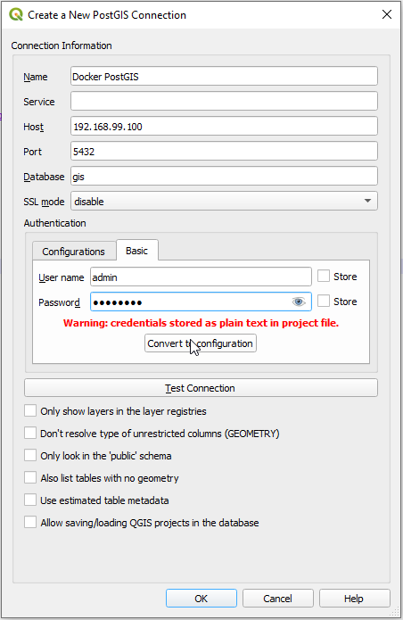
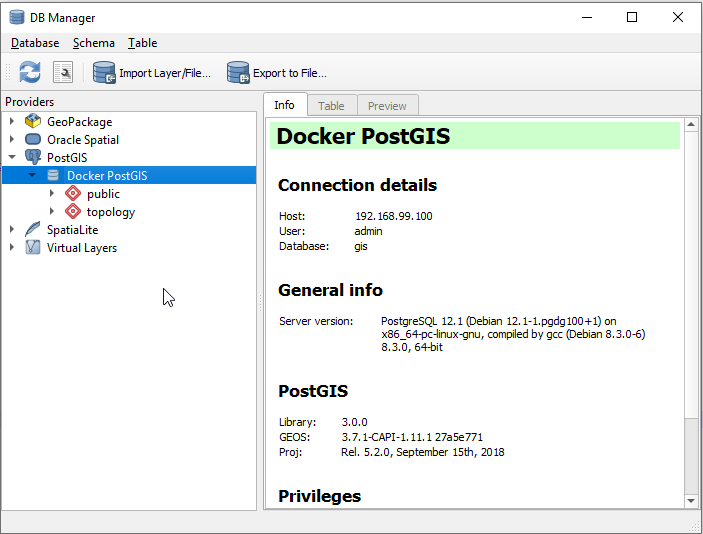
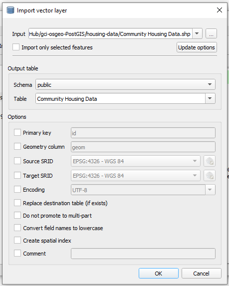

# gci-osgeo-PostGIS

This repository demonstartes how to set up a PostGIS database.

# Downloading and installing Docker

(Copied from https://github.com/mdu02/gci-OSGeo-WMSTutorial)

We will be running our database in a container on Docker. You can find an open-source version of Docker Toolbox (which should run on any modern PC running Windows) at [this github link](https://github.com/docker/toolbox/releases).

1. Download the .exe file from GitHub
2. Run the .exe file. There will be a prompt to allow an Oracle driver to install; click yes.
3. You should now have Docker Toolbox installed.

# Downloading and installing QGIS 

We will be accessing the database with QGIS, which we can download [here](https://qgis.org/en/site/forusers/download.html).

1. Download the .exe installer from the download page.
2. When prompted, choose Desktop Express Install.
3. Click "I agree" to all non-opensource packages (after reading the agreements, of course)

# Data

The data being used in this tutorial is in /housing-data and [contains information licensed under the Open Government Licence – Toronto.](https://www.toronto.ca/city-government/data-research-maps/open-data/open-data-licence/)

# Steps

1. Run the following docker command
```
docker run -e POSTGRES_USER=admin -e POSTGRES_PASS=password -e POSTGRES_DBNAME=gis -e ALLOW_IP_RANGE=0.0.0.0/0 -p 5432:5432 -v pg_data:/var/lib/postgresql kartoza/postgis
```

2. Open up QGIS.
3. In the "browser" section of the QGIS window, right-click on PostGIS and select "New Connection"
4. Fill out the dialogue box. The database name is the flag in the docker command, the IP is the host IP from the docker window, and the username and password and the flags in the command as well.

5. Click the database menu at top, then DB Manager. Double-click on PostGIS, then the connection you have created.

6. Click the "import layer/file" button, then navigate to your desired layer. Click OK, and your database should now contain the layer.


